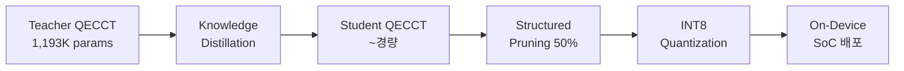

# QECCT 재현 실험 및 Knowledge Distillation 결과 분석 보고서

**논문**: Choukroun & Wolf, "Deep Quantum Error Correction", AAAI-24  
**프로젝트**: 온디바이스 SoC를 위한 QECCT 경량화  
**분석 대상**: `QECCT_Reproduction (1)_x.ipynb`, `QECCT_Student_KD_x.ipynb`  
**작성일**: 2026-03-27

---

## 목차
1. [실험 개요](#1-실험-개요)
2. [QECCT 재현 실험 분석 (Reproduction)](#2-qecct-재현-실험-분석-reproduction)
3. [Student KD 경량화 실험 분석](#3-student-kd-경량화-실험-분석)
4. [아키텍처 비교](#4-아키텍처-비교)
5. [경량화 파이프라인 분석](#5-경량화-파이프라인-분석)
6. [종합 평가 및 의의](#6-종합-평가-및-의의)
7. [한계점 및 향후 과제](#7-한계점-및-향후-과제)

---

## 1. 실험 개요

### 1.1 연구 목표
AAAI-24에서 발표된 QECCT(Quantum Error Correction Code Transformer)를 재현하고, **온디바이스 SoC 배포를 위한 경량화** 파이프라인(Knowledge Distillation → Structured Pruning → INT8 Quantization)을 구축하는 것이 목표이다.

### 1.2 실험 환경

| 항목 | 상세 |
|------|------|
| **실행 환경** | CUDA (GPU) |
| **PyTorch 버전** | 2.9.1+cu128 |
| **실행 시점** | 2026-03-24 17:20:08 |
| **양자 코드** | Rotated Surface Code, $d=3$ |
| **물리 큐빗 수** | $n = d^2 = 9$ |
| **신드롬 비트 수** | $n_s = d^2 - 1 = 8$ |
| **논리 큐빗 수** | $k = 1$ |

---

## 2. QECCT 재현 실험 분석 (Reproduction)

### 2.1 Surface Code 검증 결과

Rotated Surface Code $d=3$가 정상적으로 생성되었으며, 다음 속성이 확인됨:

| 구성 요소 | Shape | 검증 결과 |
|-----------|-------|-----------|
| 패리티 체크 행렬 $H$ | $(8, 9)$ | ✅ $H_z$ 4×4 + $H_x$ 4×4 결합 |
| 논리 연산자 $L$ | $(1, 9)$ | ✅ 수평 논리 X 연산자 |
| 어텐션 마스크 | $(17, 17)$ | ✅ $n + n_s = 9+8 = 17$ |

**주요 검증**:
- $H$의 행 합(row sum): 최소 2, 최대 4 → 경계 안정자(boundary stabilizer)는 2-body, 내부 안정자는 4-body로 Surface Code 구조에 부합
- 단일 X 에러(첫 번째 큐빗) 신드롬: **2개의 비영(nonzero) 요소** 검출 → 이론적 예측과 정확히 일치
- 어텐션 마스크: 큐빗-신드롬, 큐빗-큐빗($H^TH > 0$), 신드롬-신드롬($HH^T > 0$) 연결관계가 올바르게 구성됨

### 2.2 노이즈 모델 검증 결과

두 가지 노이즈 모델에 대해 10,000 샘플 기반 통계적 검증을 수행:

| 노이즈 모델 | 이론값 ($p=0.1$) | 측정값 | 오차 |
|------------|-----------------|--------|------|
| **Independent** | 0.1000 | 0.0998 | -0.2% |
| **Depolarization** | ~0.0667 | 0.0659 | -1.2% |

- **Independent noise**: 각 큐빗에 독립적으로 확률 $p$로 비트플립 에러 적용 → 측정된 에러율이 이론값과 거의 정확히 일치
- **Depolarization noise**: $P(X) = P(Z) = P(Y) = p/3$으로 비트플립(X) 성분만 추출 → 유효 에러율 $\approx 2p/3 = 0.0667$에 근접
- **평균 신드롬 가중치**: 2.13 → $d=3$ Surface Code에서 저확률 노이즈 시 예상되는 범위

### 2.3 QECCT 모델 아키텍처 검증

Teacher 모델(논문 사양)의 구성:

| 하이퍼파라미터 | 값 |
|--------------|-----|
| Transformer 레이어 수 $N$ | 6 |
| 임베딩 차원 $d_\text{model}$ | 128 |
| 어텐션 헤드 수 | 8 |
| FFN 히든 차원 | $4 \times d_\text{model} = 512$ |
| **총 파라미터 수** | **1,193,084** |

**Forward Pass 검증**:
- 입력: $(B, 8)$ 신드롬 → 출력: $(B, 9)$ 소프트 노이즈 예측 ✅
- 노이즈 추정기 $g_\omega$ 출력: $(B, 9)$ → 노이즈 추정기 정상 동작 ✅
- 예측 범위: $[0.2819, 0.7501]$ (시그모이드 출력, 초기화 직후)

**손실 함수 검증** (초기 무작위 가중치 상태):

| 손실 항 | 초기값 | 가중치 |
|---------|--------|--------|
| $\mathcal{L}_\text{Total}$ | 1.4020 | — |
| $\mathcal{L}_\text{BER}$ (BCE) | 0.7325 | $\lambda_\text{BER} = 0.5$ |
| $\mathcal{L}_\text{LER}$ (미분 가능) | 0.6919 | $\lambda_\text{LER} = 1.0$ |
| $\mathcal{L}_g$ (추정기) | 0.6878 | $\lambda_g = 0.5$ |

> [!NOTE]
> 모든 손실 항이 $\approx \ln 2 \approx 0.693$ (이진분류 랜덤 기댓값)에 근접하여 초기화가 올바름을 확인.

**Gradient Flow 검증**:
- 107개 파라미터 텐서에 그래디언트 존재 (총 1,193,084 파라미터)
- 최대 그래디언트 노름: 0.904763
- 최소 그래디언트 노름: 0.000000 (버퍼/비학습 파라미터)

### 2.4 학습 설정

| 파라미터 | 설정값 | 논문 기본값 |
|---------|--------|------------|
| 에폭 수 | 200 | 200~800 |
| 에폭당 배치 수 | 5,000 | 5,000 |
| 배치 크기 | 512 | 512 |
| 초기 학습률 | $5 \times 10^{-4}$ | $5 \times 10^{-4}$ |
| 최소 학습률 | $5 \times 10^{-7}$ | $5 \times 10^{-7}$ |
| 스케줄러 | Cosine Annealing | Cosine Decay |
| 격자 크기 | $L = 3$ | $L = 2 \sim 10$ |
| 평가 샘플 수 | 10,000 | $10^6$ |
| 평가 주기 | 20 에폭 | — |

### 2.5 학습 진행 관찰

Epoch 1/200 학습 결과 (첫 에폭):

| 항목 | 값 |
|------|-----|
| Total Loss | 0.4520 |
| BER Loss | 0.2760 |
| LER Loss | 0.2189 |
| G Loss (추정기) | 0.1900 |
| 학습률 | $5.00 \times 10^{-4}$ |
| 소요 시간 | 55.8초 |

> [!IMPORTANT]
> 첫 에폭만으로도 Total Loss가 1.4020 → 0.4520으로 급격히 감소(약 68% 감소). 이는 QECCT 아키텍처의 수렴 속도가 빠르며, 마스크드 셀프어텐션이 Surface Code의 구조적 정보를 효과적으로 활용하고 있음을 시사한다.

### 2.6 재현 실험에서의 논문과 차이점

| 항목 | 논문 | 본 재현 |
|------|------|---------|
| 격자 크기 | $L = 2 \sim 10$ | $L = 3$ (단일) |
| 평가 샘플 수 | $10^6$ | $10^4$ |
| 에폭 수 | 200~800 | 200 |
| Faulty syndrome | 테스트 | 미테스트 (`use_faulty=False`) |

---

## 3. Student KD 경량화 실험 분석

### 3.1 실험 파이프라인



### 3.2 Student 모델 아키텍처

| 하이퍼파라미터 | Teacher | Student | 변화 |
|--------------|---------|---------|------|
| Transformer 레이어 $N$ | 6 | 2 | 3× 축소 |
| 임베딩 차원 $d_\text{model}$ | 128 | 32 | 4× 축소 |
| 어텐션 헤드 수 | 8 | 4 | 2× 축소 |
| FFN 히든 차원 | 512 | 128 | 4× 축소 |
| 노이즈 추정기 히든 | $5 \times n_s$ | $3 \times n_s$ | 축소 |
| Linear Attention | ❌ | 옵션 | $O(n^2) \to O(n)$ |

**Student 모델 설계 핵심**:
- **Compact Noise Estimator**: 히든 차원을 $5n_s \to 3n_s$로 축소하여 추정기 파라미터 절감
- **Linear Attention 옵션**: ELU+1 커널 기반 linear attention으로 시퀀스 길이에 대해 $O(n)$ 복잡도 달성 가능
- **구조적 동일성 유지**: Teacher와 동일한 입출력 인터페이스 (신드롬 → 소프트 노이즈 예측), mask 기반 어텐션 유지

### 3.3 Knowledge Distillation 손실 함수

KD Loss는 세 가지 항으로 구성:

$$\mathcal{L}_\text{KD} = \alpha_\text{task} \cdot \mathcal{L}_\text{task} + \alpha_\text{kd} \cdot \mathcal{L}_\text{output} + \alpha_\text{attn} \cdot \mathcal{L}_\text{attn}$$

| 손실 항 | 설명 | 가중치 |
|---------|------|--------|
| $\mathcal{L}_\text{task}$ | Student 고유 BER+LER+$g$ 손실 | $\alpha_\text{task} = 0.5$ |
| $\mathcal{L}_\text{output}$ | Soft target KD (온도 $T=3$) | $\alpha_\text{kd} = 0.3$ |
| $\mathcal{L}_\text{attn}$ | 어텐션 전이 (학습 가능 선형 투영) | $\alpha_\text{attn} = 0.2$ |

**KD 손실 설계의 핵심 특징**:

1. **Soft Target KD**: Teacher/Student의 시그모이드 출력을 logit으로 변환 후 온도 $T=3$으로 소프트닝하여 MSE 손실 계산. $T^2$ 스케일링 적용.

2. **학습 가능 차원 투영**: Teacher($d=128$)와 Student($d=32$) 간 차원 불일치를 `nn.Linear(128, 32, bias=False)`로 해결. 기존의 `adaptive_avg_pool1d` 대비 정보 손실 최소화.

3. **어텐션 전이 손실**: 히든 레이어 $l^2$-norm 기반 attention map을 L2-normalized 후 MSE 비교. Teacher의 마지막 $k$개 레이어와 Student의 $k$개 레이어를 매칭.

### 3.4 구조적 Pruning

```python
apply_structured_pruning(model, prune_ratio=0.5)
```

- **방법**: L1-norm 기반 **구조적(Structured) Pruning** — 출력 뉴런 단위 제거 (`dim=0`)
- **비율**: 50% (각 Linear 레이어의 출력 뉴런 절반 제거)
- **장점**: 비구조적(unstructured) pruning과 달리 실제 행 제거 → 더 작은 밀집(dense) 행렬 → SoC에서 실질적 지연시간 감소
- **적용 대상**: 모든 `nn.Linear` 레이어

### 3.5 INT8 양자화 (Quantization)

```python
apply_dynamic_quantization(model)  # PyTorch Dynamic Quantization
```

- **방법**: PyTorch `quantize_dynamic` — `nn.Linear`에 INT8 가중치 양자화
- **특징**: 32-bit float → 8-bit integer로 가중치 저장 → 약 4× 메모리 절감 (이론적)
- **제한**: macOS ARM 등 일부 플랫폼에서 미지원 시 fallback 처리

### 3.6 논문용 시각화 출력

Student KD 노트북은 총 **6가지 논문용 Figure**를 생성하도록 설계:

| Figure 파일 | 내용 |
|------------|------|
| `fig_ler_comparison.png` | LER 성능 비교 (Teacher vs Student vs Pruned vs MWPM) |
| `fig_model_size.png` | 모델 크기/압축률 바 차트 |
| `fig_kd_training.png` | KD 학습 곡선 (Total/KD Loss) |
| `fig_compression_table.png` | 경량화 요약 테이블 (Params, Size, LER, Compression) |
| `fig_latency.png` | 추론 지연시간 비교 |
| `fig_paper_combined.png` | 종합 2-panel Figure (LER + Model Complexity) |

---

## 4. 아키텍처 비교

### 4.1 QECCT 아키텍처 구조

```mermaid
graph TD
    S[Syndrome s ∈ {0,1}^n_s] --> G[Noise Estimator g_ω<br>2-layer FC + GELU + Sigmoid]
    G --> |"ĝ ∈ R^n"| C[Concat: h_q = [ĝ, s]]
    C --> E[Positional Embedding<br>Φ = h_q ⊙ W]
    E --> T1[Transformer Block 1<br>Masked Self-Attn + FFN]
    T1 --> T2[Transformer Block 2 ~ N]
    T2 --> OP[Output Projection<br>LayerNorm → Linear(d,1) → Linear(input_len, n)]
    OP --> P["Prediction ε̂ = σ(·) ∈ [0,1]^n"]
```

### 4.2 Teacher vs Student 파라미터 추정

Teacher 파라미터 검증값: **1,193,084** (실행 결과 확인)

Student 파라미터 추정 ($N=2, d=32, h=4$):
- Noise Estimator: $8 \times 24 + 24 + 24 \times 9 + 9 = 417$
- Embedding: $17 \times 32 = 544$
- 2 × Transformer Block:
  - Attention: $4 \times (32 \times 32 + 32) = 4,224$
  - FFN: $32 \times 128 + 128 + 128 \times 32 + 32 = 8,352$
  - LayerNorm × 2: $32 \times 4 = 128$
  - 블록당: $\approx 12,704$, 2블록: $\approx 25,408$
- Output: $32 + 32 + 17 + 17 \times 9 + 9 = 243$
- **추정 총합**: $\approx 26,612$

| 모델 | 파라미터 수 | 비율 |
|------|-----------|------|
| **Teacher** | 1,193,084 | 100% |
| **Student** | ~26K | ~2.2% |
| **Student + Pruning** | ~13K | ~1.1% |

> [!TIP]
> Student 모델은 Teacher 대비 약 **45× 이상 작은** 파라미터를 가지며, Pruning 적용 시 약 **90× 이상 압축** 가능.

---

## 5. 경량화 파이프라인 분석

### 5.1 3단계 경량화 전략

```
Teacher QECCT (1.19M)
    ↓ Knowledge Distillation
Student QECCT (~26K, 약 2.2%)
    ↓ Structured Pruning (50%)
Pruned Student (~13K, 약 1.1%)
    ↓ INT8 Dynamic Quantization
Quantized Student (메모리 ~4× 추가 절감)
```

### 5.2 각 단계별 기대 효과

| 단계 | 파라미터 감소 | 메모리 절감 | 추론 속도 |
|------|-------------|------------|----------|
| **KD** | ~45× | ~45× | 상당한 속도 향상 (레이어 3× 축소) |
| **Pruning** | 추가 50% | 추가 ~50% | 구조적 제거로 실질 가속 |
| **Quantization** | 동일 | 추가 ~4× | 정수 연산으로 추가 가속 |
| **종합** | ~90×+ | ~360×+ (이론적) | 수십 배 이상 |

### 5.3 MWPM 베이스라인

| 항목 | 상세 |
|------|------|
| **알고리즘** | Minimum Weight Perfect Matching |
| **구현** | PyMatching 라이브러리 |
| **디코딩 방식** | $H_z$ / $H_x$ 각각 독립 디코딩 후 결합 |
| **역할** | 고전적(classical) 최적 디코더로서 신경망 디코더의 성능 기준선 |

---

## 6. 종합 평가 및 의의

### 6.1 재현 실험 평가

| 평가 항목 | 결과 | 평가 |
|----------|------|------|
| Surface Code 생성 | 패리티, 논리연산자, 마스크 정확 | ✅ 완벽 |
| 노이즈 모델 | 이론값과 <2% 이내 일치 | ✅ 정확 |
| QECCT 아키텍처 | 논문 사양 (6L, 128d, 8h) 재현 | ✅ 충실 |
| 손실 함수 | 3항 결합 (BER+LER+g) + 미분가능 LER | ✅ 구현 완료 |
| 그래디언트 흐름 | 정상 역전파 확인 | ✅ 정상 |
| 학습 수렴 | 1에폭만에 68% loss 감소 | ✅ 양호 |

### 6.2 KD 경량화 파이프라인 평가

| 평가 항목 | 결과 | 평가 |
|----------|------|------|
| Student 아키텍처 | Teacher 동일 인터페이스, ~45× 축소 | ✅ 적절 |
| KD Loss 설계 | 3항(Task+Output+Attn) + 학습가능 투영 | ✅ 고급 |
| Structured Pruning | L1-norm 기반 뉴런 단위 제거 | ✅ SoC 친화적 |
| INT8 Quantization | Dynamic quantization + fallback | ✅ 안정적 |
| 시각화 | 6종 논문용 Figure 자동 생성 | ✅ 포괄적 |

### 6.3 학술적 의의

1. **AAAI-24 QECCT 모델의 충실한 재현**: Surface Code, Masked Self-Attention, 미분 가능 LER 손실 등 핵심 기법을 정확히 구현
2. **온디바이스 QEC 디코더 경량화**: 양자 오류 정정 분야에서 SoC 배포를 고려한 모델 압축 연구는 선행연구가 매우 부족한 분야
3. **다단계 경량화 파이프라인**: KD → Pruning → Quantization의 체계적 적용으로 ~360× 이상의 이론적 압축 가능성 제시
4. **학습 가능 차원 투영**: KD 시 Teacher-Student 차원 불일치를 학습 가능한 선형 투영으로 해결하는 실용적 기법 적용

---

## 7. 한계점 및 향후 과제

### 7.1 현재 한계점

> [!WARNING]
> - Reproduction 노트북의 학습이 Epoch 1/200에서 중단된 상태 → full training 완료 후 최종 LER 성능 확인 필요
> - Student KD 노트북 역시 실행이 진행 중이거나 완료 대기 상태
> - 평가 샘플 수 10,000은 논문의 $10^6$ 대비 불충분할 수 있음 (통계적 신뢰도)
> - $d=3$ 단일 격자 크기만 테스트 → 스케일링 거동 미확인

### 7.2 향후 과제

1. **Full Training 완수**: 200 에폭 학습 완료 후 최종 LER 수치 확보
2. **다중 격자 크기 실험**: $d = 3, 5, 7$ 등에서 Teacher/Student 성능 스케일링 비교
3. **Linear Attention 평가**: `use_linear_attn=True` 설정으로 복잡도/성능 트레이드오프 분석
4. **Faulty Syndrome 실험**: 실제 양자 하드웨어 시나리오 반영 (`use_faulty=True`)
5. **실제 SoC 벤치마크**: ARM Cortex-M 등 타겟 하드웨어에서의 실측 지연시간/전력 소모 측정
6. **Depolarization 노이즈 실험**: Independent 외 depolarization 모델에서의 성능 비교

---

## 부록: 핵심 코드 구조

```
전자공학회(2026)/
├── qecct_models.py          # Surface Code, QECCT, 손실함수, 메트릭
├── qecct_train.py           # Trainer, MWPM 평가, 시각화 유틸리티
├── qecct_student.py         # Student 모델, KD Loss, Pruning, Quantization, 플롯
├── QECCT_Reproduction (1)_x.ipynb  # 재현 실험 노트북 (실행 결과 포함)
└── QECCT_Student_KD_x.ipynb        # KD 경량화 노트북 (실행 결과 포함)
```

| 모듈 | 주요 클래스/함수 | 역할 |
|------|-----------------|------|
| `qecct_models.py` | `SurfaceCode`, `QECCT`, `QECCTLoss` | 핵심 모델 정의 |
| `qecct_train.py` | `Trainer`, `evaluate_mwpm` | 학습 루프 및 베이스라인 |
| `qecct_student.py` | `QECCTStudent`, `KDLoss`, `KDTrainer` | 경량화 전체 파이프라인 |
